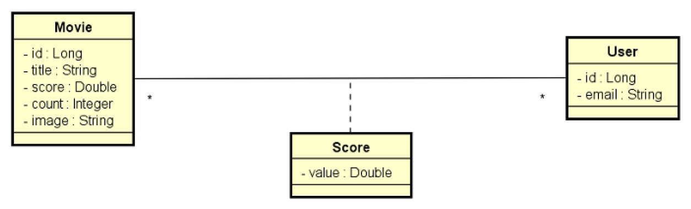
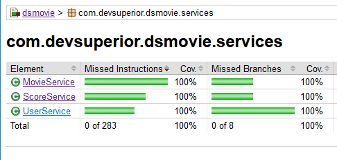

<div align="left">
  <h1><strong>DSMovie Jacoco</strong></h1>
</div>

## Índice

- [Sobre](#sobre)
- [Casos de uso](#casos-de-uso)
- [Relatório Jacoco](#relatorio-jacoco)
- [Como executar o projeto](#como-executar-o-projeto)
- [Tecnologias Utilizadas](#tecnologias-utilizadas)
- [Como Contribuir](#como-contribuir)

## Sobre

Este é um projeto de filmes e avaliações de filmes. A visualização dos dados dos filmes é
pública (não necessita login), porém as alterações de filmes (inserir, atualizar, deletar) são
permitidas apenas para usuários ADMIN. As avaliações de filmes podem ser registradas por
qualquer usuário logado CLIENT ou ADMIN. A entidade Score armazena uma nota de 0 a 5
(score) que cada usuário deu a cada filme. Sempre que um usuário registra uma nota, o
sistema calcula a média das notas de todos usuários, e armazena essa nota média (score) na
entidade Movie, juntamente com a contagem de votos (count).

Objetivo desse projeto é o Jacoco reportar 100% dos teste!
<div align="center">
  
</div>

A especificação do que foi implementado está no próprio código fonte dos testes automatizados.


[Voltar ao Índice](#índice)

## Relatório Jacoco

### Configuração:

```xml
<plugin>
    <groupId>org.jacoco</groupId>
    <artifactId>jacoco-maven-plugin</artifactId>
    <version>0.8.7</version>
    <configuration>
        <excludes>
            <exclude>com/devsuperior/dsmovie/DsmovieApplication.class</exclude>
            <exclude>com/devsuperior/dsmovie/config/**</exclude>
            <exclude>com/devsuperior/dsmovie/entities/**</exclude>
            <exclude>com/devsuperior/dsmovie/dto/**</exclude>
            <exclude>com/devsuperior/dsmovie/controllers/**</exclude>
            <exclude>com/devsuperior/dsmovie/controllers/handlers/**</exclude>
            <exclude>com/devsuperior/dsmovie/services/exceptions/**</exclude>
            <exclude>com/devsuperior/dsmovie/utils/**</exclude>
        </excludes>
    </configuration>
    <executions>
        <execution>
            <goals>
                <goal>prepare-agent</goal>
            </goals>
        </execution>
        <execution>
            <id>jacoco-report</id>
            <phase>prepare-package</phase>
            <goals>
                <goal>report</goal>
            </goals>
            <configuration>
                <outputDirectory>target/jacoco-report</outputDirectory>
            </configuration>
        </execution>
    </executions>
</plugin>
```

### Relatório final:

<div align="center">
  
</div>

[Voltar ao Índice](#índice)

## Casos de Uso

### MovieServiceTests:
- findAllShouldReturnPagedMovieDTO
- findByIdShouldReturnMovieDTOWhenIdExists
- findByIdShouldThrowResourceNotFoundExceptionWhenIdDoesNotExist
- insertShouldReturnMovieDTO
- updateShouldReturnMovieDTOWhenIdExists
- updateShouldThrowResourceNotFoundExceptionWhenIdDoesNotExist
- deleteShouldDoNothingWhenIdExists
- deleteShouldThrowResourceNotFoundExceptionWhenIdDoesNotExist
- deleteShouldThrowDatabaseExceptionWhenDependentId

### ScoreServiceTests:
- saveScoreShouldReturnMovieDTO
- saveScoreShouldThrowResourceNotFoundExceptionWhenNonExistingMovieId

### ScoreServiceTests:
- authenticatedShouldReturnUserEntityWhenUserExists
- authenticatedShouldThrowUsernameNotFoundExceptionWhenUserDoesNotExists
- loadUserByUsernameShouldReturnUserDetailsWhenUserExists
- loadUserByUsernameShouldThrowUsernameNotFoundExceptionWhenUserDoesNotExists

[Voltar ao Índice](#índice)


## Como executar o projeto

1. Clonar o projeto a partir do GitHub

   ````https://github.com/felipeam10/DSMovie-Jacoco````

2. Em sua IDE de preferência, abra o projeto a partir do diretório que o mesmo foi clonado. 

3. Importe as Collections do postman a partir do caminho: ````src/main/resources/postmanFiles````

[Voltar ao Índice](#índice)


## Tecnologias Utilizadas

Antes de iniciar, assegure-se de ter o ambiente Java corretamente configurado em sua máquina. Abaixo você tem a relação das tecnologias que foram utilizadas no processo de desenvolvimento do projeto.

| Tecnologia                  | Versão                                     |
| --------------------------- |--------------------------------------------|
| Sistema Operacional         | Windows 10                                 |
| Linguagem de Programação (JDK) | java 17.0.7 2023-04-18 LTS                 
| Framework                   | Spring Boot 3.1.10                         |
| Banco de Dados              | H2 Database                                |
| IDE                         | IntelliJ IDEA 2023.1.1 (Community Edition) |
| Ferramenta de Teste de API  | Postman v10.17.4                           |

[Voltar ao Índice](#índice)

## Contribuições 

Caso tenha uma contribuição que possa melhorar este projeto, por favor, abra uma issue ou um pull request, seguindo os passos abaixo.

1. Crie um 'Fork' do projeto
2. Crie uma 'Branch' para sua modificação (`git checkout -b feature/yourFeatureName`)
3. Faça o 'Commit' das suas mudanças (`git commit -m 'Add some yourFeatureName'`)
4. 'Push' para a 'Branch' (`git push origin feature/yourFeatureName`)
5. Abra uma 'Pull Request'

[Voltar ao Índice](#índice)

